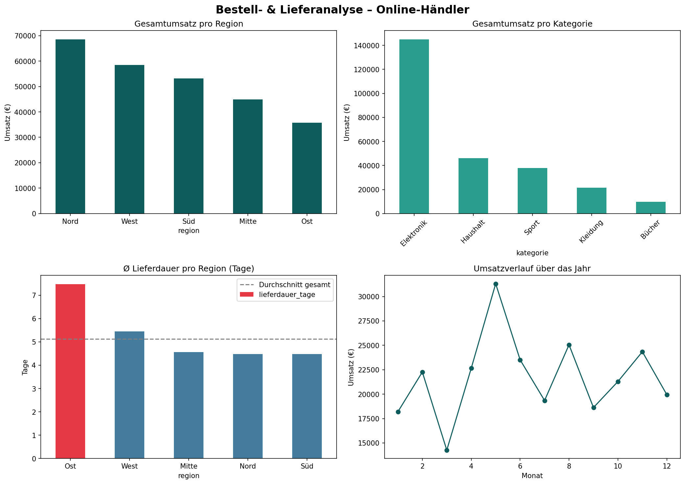

# 📦 Bestell- & Lieferanalyse eines Online-Händlers

Datenanalyse-Projekt mit **Python & Pandas** – von der Datenaufbereitung
über die Analyse bis zur Visualisierung und Handlungsempfehlung.

## 🎯 Ziel
Bestell- und Lieferdaten auswerten, um Umsatztreiber zu erkennen und
Schwachstellen im Lieferprozess aufzudecken.

## 🛠️ Verwendete Tools
`Python` · `Pandas` · `NumPy` · `Matplotlib` · `Google Colab`

## 🔍 Vorgehen
1. **Datensatz erstellen & laden** – 1.000 Bestellungen mit Region, Kategorie, Preis, Liefer­datum
2. **Datenaufbereitung** – Prüfung auf fehlende Werte, Berechnung der Lieferdauer
3. **Analyse** – Umsatz pro Region/Kategorie, Ø Lieferzeit pro Region (`groupby`)
4. **Visualisierung** – Dashboard mit vier Diagrammen
5. **Erkenntnisse & Empfehlung**

## 📊 Dashboard

## 💡 Wichtigste Erkenntnisse
- **Umsatzstärkste Region:** Nord (~68.600 €)
- **Umsatzstärkste Kategorie:** Elektronik (~145.000 € – mehr als alle anderen zusammen)
- **Zentrales Problem:** Die Region **Ost** hat mit **7,5 Tagen** die längste Lieferdauer
  (Durchschnitt gesamt: 5,1 Tage) – und ist gleichzeitig die umsatzschwächste Region.

## ✅ Handlungsempfehlung
Logistikprozesse in der Region **Ost** prüfen und optimieren, um Lieferzeiten
zu senken und mögliches Umsatzpotenzial zu erschließen.

---
📁 **Dateien:** `Bestell_Lieferanalyse.ipynb` (Notebook) · `bestelldaten.csv` (Daten) · `dashboard.png`
